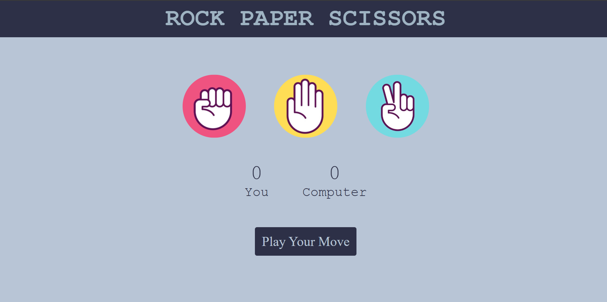

# Rock-paper-scissor-game
<<<<<<< HEAD

This is a web game made using HTML , CSS and JS.
 
It allows the user to play against the computer and the winner is decided based on basic game rules.
 
Scores are updated and the winner is displayed after each round along with the choices made by each player.
 
#Screenshot

#How to Play 
1.Click on Rock, Paper, or Scissors. 
2.The computer randomly selects its move. 
3.The winner is determined using the standard Rock Paper Scissors rules. 
4.Scores are updated after each round  

=======
This is a web game made using HTML , CSS and JS.
 
It allows two players to play together at a time .
>>>>>>> c8c26ab9ac7d31fbd3d63b47ac3307d7a0b721d4
